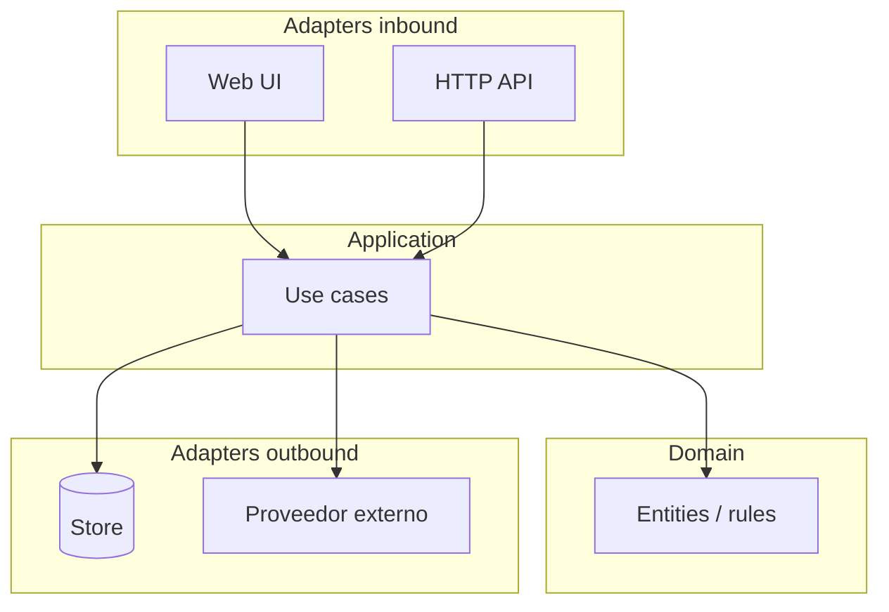
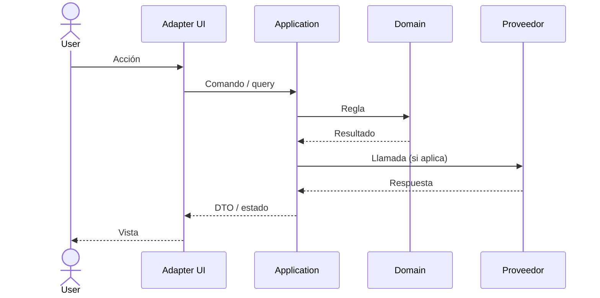

# Diagramas Mermaid (agente `architect`)

El **architect** debe generar diagramas **Mermaid** en landscape, ADRs y Design Packages.
No sustituyen tablas/texto: los complementan.

## Obligatorio

| Artefacto | Diagrama de componentes | Diagrama de secuencia |
|-----------|-------------------------|------------------------|
| `landscape.md` | **Sí** — vista del sistema (módulos, adapters, externos, nubes) | **Sí** si hay ≥1 flujo crítico as-built; si no, placeholder “pendiente primera historia” |
| ADR nuevo | **Sí** cuando la decisión cambia topología / proveedores / fronteras | **Sí** cuando la decisión cambia un flujo runtime |
| Design Package | **Sí** — componentes tocados por la historia (hexagonal) | **Sí** — al menos el flujo feliz principal del BP (+ error si es crítico) |

## Convenciones

- Usar bloques \`\`\`mermaid … \`\`\` (renderizan en GitHub / muchos viewers Markdown).
- Nombres cortos y estables (módulos del landscape, no jerga inventada).
- Capas hexagonales visibles cuando aplique: `Domain`, `Application`, `Adapters`.
- Externos (Auth0, Stripe, etc.) como participantes/nodos claros.
- Idioma: mismo que el resto del artefacto (es/en del proyecto).

## Componentes (`flowchart` / `C4Context`-like)

Preferir `flowchart TB` o `flowchart LR`:

En landscape: un diagrama del **sistema actual** (as-built + planned marcados).  
En ADR: **antes → después** o solo el estado decidido.  
En DS: solo lo que **toca esta historia** (create/extend).

## Secuencia (`sequenceDiagram`)

Incluir al menos: actor, adapters, application, y externos relevantes.  
Si hay auth redirect: incluir el proveedor en la secuencia (callback).

## Checklist del architect (antes de pasar a scribe)

- [ ] Landscape tiene diagrama de **componentes** actualizado (o justificación de “sin cambio”)
- [ ] Landscape tiene diagrama de **secuencia** del flujo crítico (o pendiente documentado)
- [ ] Cada ADR nuevo con impacto estructural/flujo trae Mermaid correspondiente
- [ ] Design Package § secuencia usa Mermaid (no solo texto ASCII)
- [ ] Design Package incluye diagrama de componentes de la historia
- [ ] Diagramas coherentes con matriz de integraciones del BP y con ADRs Accepted
