# InfoSails Agentic Harness

Kit instalable para **desarrollo agéntico**: el producto avanza por agentes (Discovery → Design → Build → Deploy), no por coding manual como camino principal.

Este repositorio es el **kit**. La **memoria del producto** no vive aquí: vive en cada proyecto instanciado (`infosails-init`) o en `playground/` para probar el harness en este mismo repo.

| | |
|--|--|
| Versión kit | ver `config/harness.yaml` (`version`) |
| Entrypoint | Director de Orquesta (`.cursor/skills/director/`) |
| Instalar | `./scripts/install` → comando `infosails-init` |
| Probar aquí | `./scripts/playground` |

---

## Tabla de contenidos

1. [Modelo mental](#1-modelo-mental)
2. [Jerarquía de agentes](#2-jerarquía-de-agentes)
3. [Pipelines](#3-pipelines)
4. [Protocolo Orquesta ↔ Lead](#4-protocolo-orquesta--lead)
5. [Memoria del proyecto](#5-memoria-del-proyecto)
6. [Procesos en detalle](#6-procesos-en-detalle)
7. [Políticas de organización](#7-políticas-de-organización)
8. [Flujo completo de una historia](#8-flujo-completo-de-una-historia)
9. [Playground](#9-playground)
10. [Instalación y proyectos](#10-instalación-y-proyectos)
11. [Estructura del kit](#11-estructura-del-kit)
12. [Referencias](#12-referencias)

---

## 1. Modelo mental

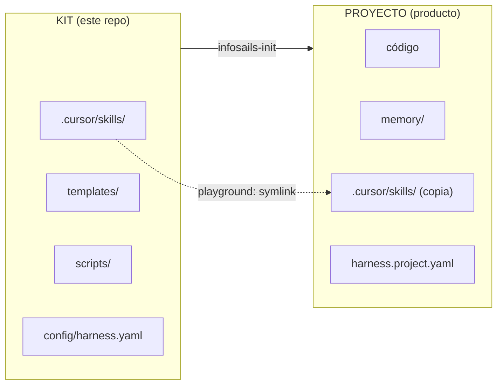

| Concepto | Qué es |
|----------|--------|
| **Kit** | Agentes, templates, schemas, scripts. Se instala una vez en la máquina. |
| **Proyecto** | Repo del producto: código + `memory/` + skills. |
| **Memoria** | Fuente de verdad durable (blueprints, designs, builds, landscape…). No el chat. |
| **Orquesta** | Único interlocutor del usuario a nivel de proceso; solo habla con Leads. |
| **Lead** | Dueño de un proceso; orquesta expertos como **subagentes** (a menudo en paralelo). |

```text
~/infosails-harness/                 ← kit
~/Projects/mi-app/                   ← proyecto
├── harness.project.yaml
├── memory/                          ← memoria del producto
├── .cursor/skills/                  ← agentes (copia del kit)
└── … código del producto …
```

---

## 2. Jerarquía de agentes

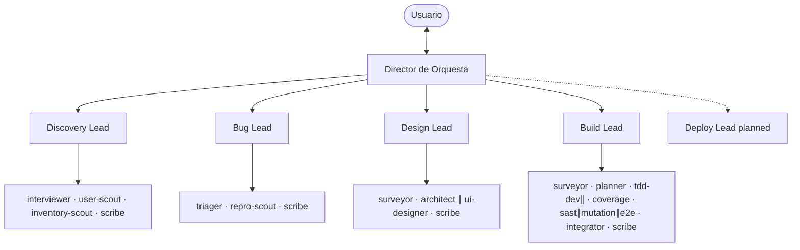

Reglas duras:

- La Orquesta **no** conoce ni activa agentes internos.
- Los subagentes reportan al **Lead**; el Lead escribe el **outbox**.
- Guía: [`.cursor/skills/_shared/lead-subagents.md`](.cursor/skills/_shared/lead-subagents.md).

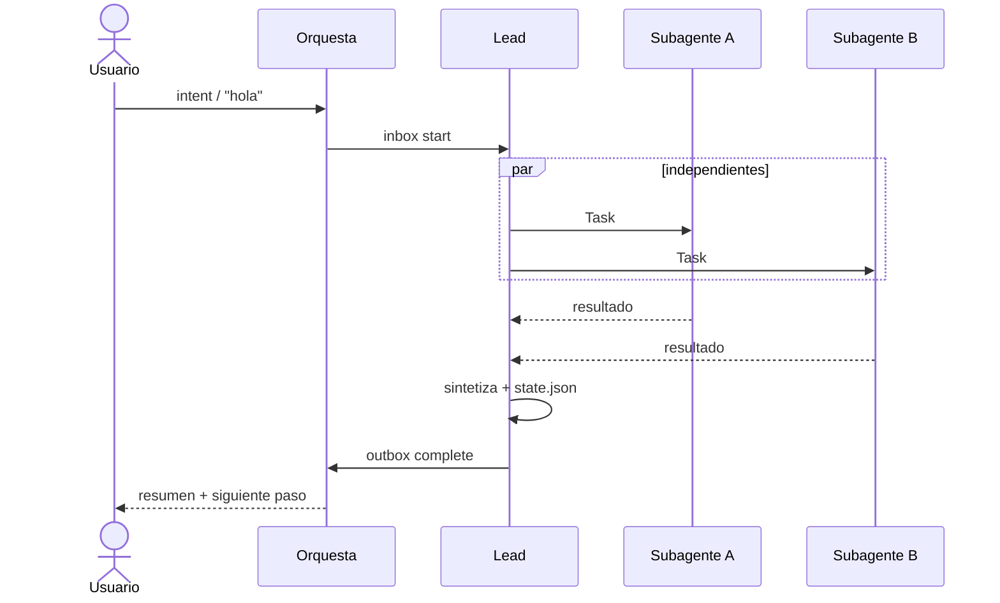

---

## 3. Pipelines

### Historia (Feature Blueprint)

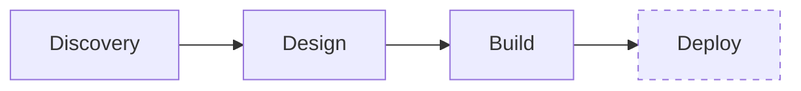

### Bug

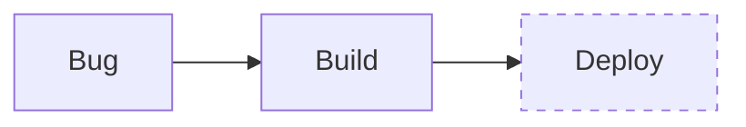

| Transición | Siguiente |
|------------|-----------|
| `discovery_done` | design |
| `design_done` | build |
| `bug_done` | build |
| `build_done` | deploy |
| `deploy_done` | — |

La Orquesta **activa** y **delega** según `next_hint` del outbox y `config/harness.yaml`.

---

## 4. Protocolo Orquesta ↔ Lead

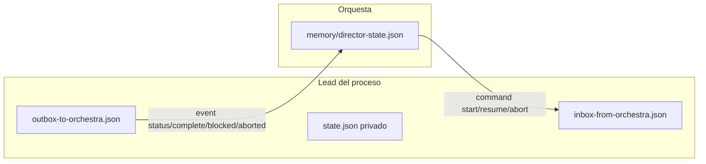

| Nivel | Archivo |
|-------|---------|
| Pipeline global | `memory/director-state.json` |
| Orquesta → Lead | `memory/processes/<proceso>/inbox-from-orchestra.json` |
| Lead → Orquesta | `memory/processes/<proceso>/outbox-to-orchestra.json` |
| Agentes del proceso | `memory/processes/<proceso>/state.json` |

**Eventos de outbox:** `status` · `complete` · `blocked` · `aborted`  
Protocolo: [`.cursor/skills/director/protocol.md`](.cursor/skills/director/protocol.md).

La Orquesta **tiene prohibido** leer/editar `processes/*/state.json` o lanzar subagentes.

---

## 5. Memoria del proyecto

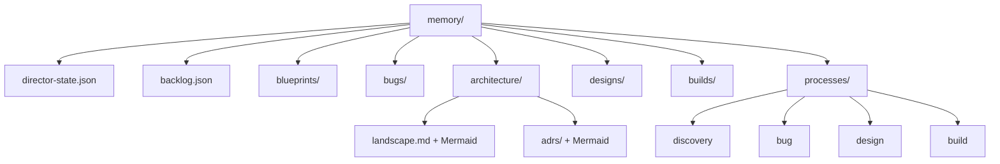

| Carpeta | Dueño típico | Contenido |
|---------|--------------|-----------|
| `blueprints/` | Discovery | Historias: usuarios, tipo de app, inventario, integraciones, Core, Gherkin |
| `bugs/` | Bug | Bug Briefs |
| `architecture/` | Design | Landscape, ADRs, as-built, repos, infra |
| `designs/` | Design | Design Packages (input de Build) |
| `builds/` | Build | Build Reports (gates TDD/cov/mutación/SAST/e2e) |
| `processes/*/` | Cada Lead | state + inbox + outbox |
| `director-state.json` | Orquesta | Focus, artefactos, procesos, historial |

IDs típicos: `BP-YYYYMMDD-SEQ` · `DS-…` · `BR-…` · `ADR-…` · `BUG-…`

---

## 6. Procesos en detalle

### 6.1 Discovery Lead

**Salida:** `memory/blueprints/`  
**Skill:** [`.cursor/skills/discovery/SKILL.md`](.cursor/skills/discovery/SKILL.md)

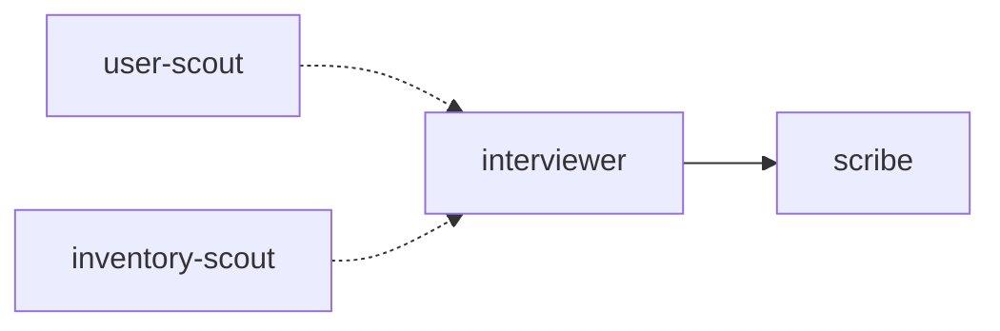

Rondas de entrevista (periodista):

| Ronda | Qué cierra |
|-------|------------|
| A | Contexto y dolor |
| A1 | **Usuarios** (perfiles, contexto, dispositivo, habilidad) |
| A1b | **Tipo de aplicación** (investigar o proponer + confirmar) |
| A2 | Inventario `YA_EXISTE` / `PARCIAL` / `NUEVO` |
| A3 | Soluciones exteriores + matriz de tipos de integración |
| B | Core atómico |
| C | Guardrails (≥5 NO) |
| D | Gherkin (≥3; rol en el *Dado que*) |
| E | Espejo y confirmación |

### 6.2 Bug Lead

**Salida:** `memory/bugs/`  
Agentes: `triager` → `scribe` (+ `repro-scout` ∥ opcional).

### 6.3 Design Lead

**Salida:** `memory/designs/` + `memory/architecture/`  
**Skill:** [`.cursor/skills/design/SKILL.md`](.cursor/skills/design/SKILL.md)

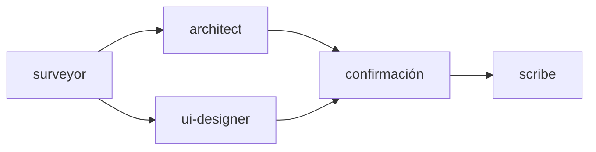

| Agente | Responsabilidad |
|--------|-----------------|
| `surveyor` | Landscape, ADRs, BP (usuarios, tipo app, integraciones), infra |
| `architect` | Hexagonal + infra Vercel/GCP + repos + **Mermaid** (componentes y secuencia) |
| `ui-designer` | `@infosails/design-system` + `csf.md`; sabores; perfiles del BP |
| `scribe` | DS + landscape/ADRs/repos; crear repos si aplica |

Diagramas: [`.cursor/skills/design/diagrams.md`](.cursor/skills/design/diagrams.md)  
UI / sabores: [`.cursor/skills/design/ui-designer.md`](.cursor/skills/design/ui-designer.md)

### 6.4 Build Lead

**Salida:** código del producto + `memory/builds/`  
**Estándares:** [`.cursor/skills/build/standards.md`](.cursor/skills/build/standards.md)

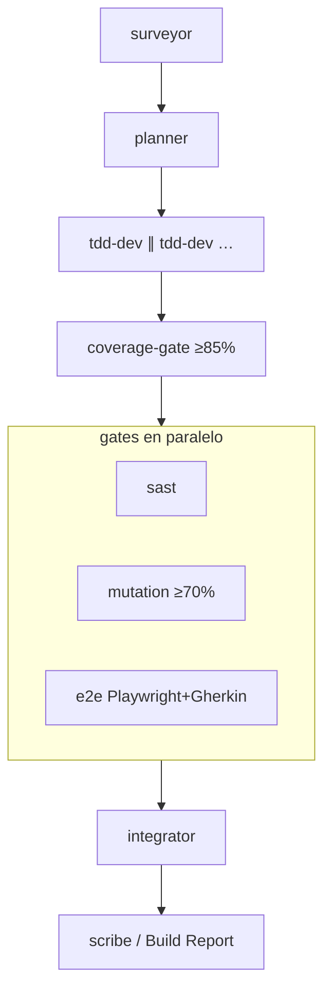

| Gate | Regla |
|------|--------|
| TDD | Red → Green → Refactor; seguridad de comportamiento en Red si aplica |
| Cobertura | ≥ **85%** scope historia |
| Mutación | score ≥ **70%** (default) |
| SAST | Semgrep (u stack); ERROR/HIGH/CRITICAL in-scope = fail |
| E2E | **Playwright** mapeado a Gherkin del BP (o skip justificado) |
| Secretos | Pedir; no inventar ni commitear |

SAST: [`.cursor/skills/build/sast.md`](.cursor/skills/build/sast.md)

---

## 7. Políticas de organización

Definidas en `config/harness.yaml` → `org` y skills de Design.

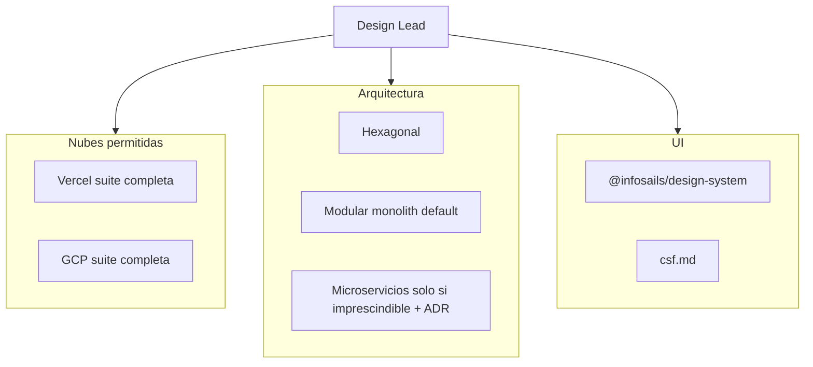

| Política | Regla |
|----------|--------|
| Nubes | Solo **Vercel** y **GCP** (suites completas). Otra nube = ADR de excepción. No forzar front→Vercel / back→GCP. |
| Arquitectura | **Hexagonal**; microservicios solo con ADR y necesidad absoluta. |
| UI | Solo **`@infosails/design-system`**; otra kit = ADR. Preguntar tema/sabor/densidad/features. |
| Diagramas | Mermaid de **componentes** y **secuencia** en landscape, ADRs relevantes y Design Packages. |

---

## 8. Flujo completo de una historia

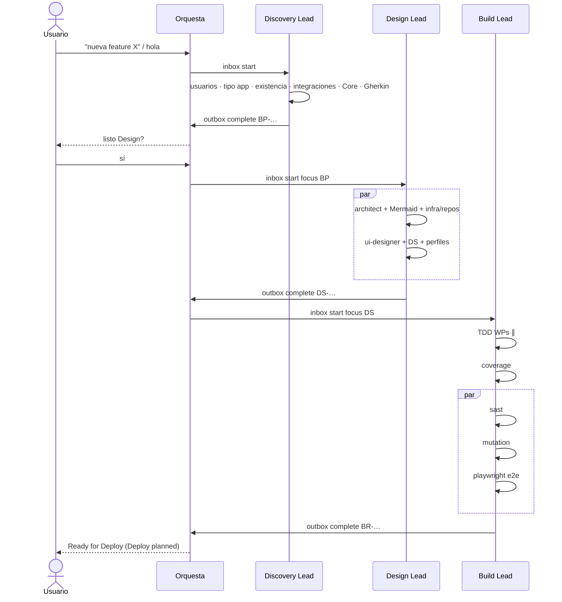

---

## 9. Playground

Proyecto simulado **dentro del kit** (no hace falta `infosails-init`).

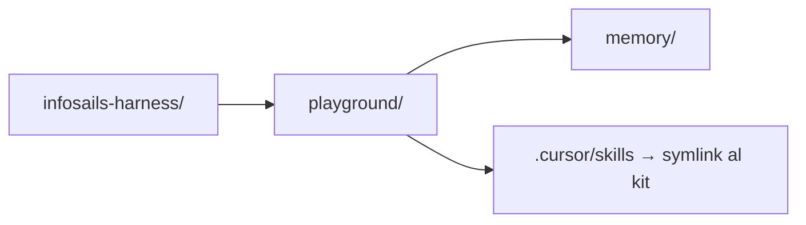

```bash
./scripts/playground                         # crear / refrescar
./scripts/playground --reset                 # limpio total
./scripts/playground --reset-keep-blueprints # limpio pero conserva blueprints
./scripts/playground --status                # rutas y conteos
```

En Cursor (abierto en el kit): `hola` o `probar playground`.  
Si existe `playground/harness.project.yaml` → `PROJECT_ROOT = playground/`.

---

## 10. Instalación y proyectos

### Instalar el kit (una vez)

```bash
cd /ruta/a/infosails-harness
./scripts/install
source ~/.zshrc   # o la rc de tu shell
```

Quedan: comando `infosails-init` y `INFOSAILS_HARNESS_HOME`.

### Proyecto nuevo

```bash
infosails-init mi-app --path ~/Projects/mi-app
cd ~/Projects/mi-app
# Abrir en Cursor → "hola"
```

### Adoptar repo existente

```bash
infosails-init . --into ~/Projects/app-existente
```

Crea: `memory/`, `.cursor/skills/` (incluye `_shared/`), `harness.project.yaml`, templates, schemas.

---

## 11. Estructura del kit

```text
infosails-harness/
├── README.md                 ← este archivo
├── AGENTS.md
├── config/harness.yaml       ← lifecycle, leads, org, gates
├── .cursor/skills/
│   ├── director/             ← Orquesta
│   ├── discovery/
│   ├── bug/
│   ├── design/               ← + ui-designer, diagrams, principles
│   ├── build/                ← + standards, sast
│   └── _shared/              ← lead-subagents.md
├── templates/                ← blueprints, DS, ADR, build-report, project/
├── schemas/                  ← JSON Schema de artefactos
├── scripts/
│   ├── install
│   ├── init-project          ← infosails-init
│   └── playground
├── phases/                   ← docs por fase
└── playground/               ← proyecto de prueba (generado)
```

---

## 12. Referencias

### Procesos

| Proceso | Lead | Escribe | Status |
|---------|------|---------|--------|
| Discovery | Discovery Lead | `memory/blueprints/` | active |
| Bug | Bug Lead | `memory/bugs/` | active |
| Design | Design Lead | `memory/designs/` + `memory/architecture/` | active |
| Build | Build Lead | código + `memory/builds/` | active |
| Deploy | — | — | planned |

### Skills y guías

| Tema | Ruta |
|------|------|
| Orquesta | `.cursor/skills/director/SKILL.md` |
| Protocolo inbox/outbox | `.cursor/skills/director/protocol.md` |
| Subagentes en paralelo | `.cursor/skills/_shared/lead-subagents.md` |
| Entrevista Discovery | `.cursor/skills/discovery/interview.md` |
| Principios arquitectura | `.cursor/skills/design/architecture-principles.md` |
| Diagramas Mermaid | `.cursor/skills/design/diagrams.md` |
| UI / design system | `.cursor/skills/design/ui-designer.md` |
| Estándares Build | `.cursor/skills/build/standards.md` |
| SAST | `.cursor/skills/build/sast.md` |
| Config org / gates | `config/harness.yaml` |

### Artefactos (templates)

| Artefacto | Template |
|-----------|----------|
| Feature Blueprint | `templates/feature-blueprint.md` |
| Design Package | `templates/design-package.md` |
| ADR | `templates/adr.md` |
| Build Report | `templates/build-report.md` |
| Landscape | `templates/project/memory/architecture/landscape.md` |
