# InfoSails Agentic Harness

[](LICENSE)
[](https://github.com/infosails/infosails-harness/actions/workflows/ci.yml)

Kit **open source** (Apache 2.0) para **desarrollo agéntico** en [Cursor](https://cursor.com): el producto avanza por agentes (Discovery → Design → Build → Deploy), no por coding manual como camino principal.

Vos hablás con un solo agente — el **Director de Orquesta**. Él activa Leads. Los Leads escriben **memoria** (`memory/`) que es la fuente de verdad. El chat se olvida; los blueprints, designs y deploys no.

Este repositorio es el **kit** (skills, templates, scripts). La memoria de *tu* producto no vive aquí: vive en el proyecto (`infosails-init`) o en `playground/` para probar el harness.

| | |
|--|--|
| Versión kit | `config/harness.yaml` → `version` |
| Licencia | [Apache License 2.0](LICENSE) |
| Hablarle | Abrí el **home** en Cursor → `hola` |
| Instalar | `./scripts/install` → `infosails-init` / `infosails-update` |
| Probar sin otro repo | `./scripts/playground` |
| Contribuir | [CONTRIBUTING.md](CONTRIBUTING.md) |

---

## Tabla de contenidos

**Usar el ecosistema**

- [Para quién](#para-quién)
- [Qué incluye](#qué-incluye)
- [Empieza en 5 minutos](#empieza-en-5-minutos)
- [Cómo hablarle](#cómo-hablarle)
- [Primera historia](#primera-historia)
- [Proyecto que ya tiene código](#proyecto-que-ya-tiene-código)
- [Qué decidís vos](#qué-decidís-vos)
- [Si algo se traba](#si-algo-se-traba)

**Referencia del kit**

1. [Modelo mental](#1-modelo-mental)
2. [Jerarquía de agentes](#2-jerarquía-de-agentes)
3. [Pipelines](#3-pipelines)
4. [Protocolo Orquesta ↔ Lead](#4-protocolo-orquesta--lead)
5. [Memoria del proyecto](#5-memoria-del-proyecto)
6. [Procesos en detalle](#6-procesos-en-detalle)
7. [Políticas de organización](#7-políticas-de-organización)
8. [Flujo completo de una historia](#8-flujo-completo-de-una-historia)
9. [Playground](#9-playground)
10. [Instalación y proyectos](#10-instalación-y-proyectos)
11. [Actualizar el harness en un proyecto](#11-actualizar-el-harness-en-un-proyecto)
12. [Variables de entorno](#12-variables-de-entorno)
13. [Estructura del kit](#13-estructura-del-kit)
14. [Referencias](#14-referencias)
15. [Contribuir](#15-contribuir)
16. [Seguridad](#16-seguridad)
17. [Licencia y marca](#17-licencia-y-marca)

---

## Para quién

Sirve si:

- Ya laburás (o querés laburar) en **Cursor** y preferís que un pipeline de agentes cierre alcance, diseño, código y deploy.
- Arrancás un producto de cero **o** adoptás un repo que ya existe (Onboard).
- Aceptás gates de calidad en Build (TDD, cobertura, complejidad, SAST, e2e).

No es:

- Una librería npm para importar en tu app.
- Un SaaS ni un servidor propio: todo corre en tu máquina, en Cursor.
- Un reemplazo de git/Vercel: Deploy usa esos tools; no los inventa.

---

## Qué incluye

| Pieza | Dónde | Para qué |
|-------|--------|----------|
| **Cursor** | tu IDE | Runtime de agentes (Orquesta + Leads + subagentes). |
| **Este kit** | `infosails-harness` | Skills, templates, schemas, `infosails-init` / `update`. |
| **Home** | repo con `harness.project.yaml` | Memoria + copia de skills. Ahí escribís `hola`. |
| **Repos de producto** | uno o más gits | El código. Puede ser el mismo git que el home. |
| **Memoria** | `memory/` | Blueprints, landscape, designs, builds, deploys, costos. |
| **Vercel** | CLI + `VERCEL_TOKEN` | Deploy a producción después de pushear `main`. |
| **GCP** | si Design lo elige | Nube permitida junto con Vercel. |
| **Design system** | el que elija el producto | shadcn, MUI, InfoSails, custom o ninguno. El kit no impone uno. |

Relación:

```text
vos  ↔  Orquesta (Cursor)  ↔  Leads  →  memory/  +  repos de producto  →  Vercel prod
              ↑
         este kit (skills)
```

---

## Empieza en 5 minutos

Hace falta: [Cursor](https://cursor.com), Git, bash, Python 3. macOS o Linux.

### A — Probar el harness (este repo)

Sin crear otro proyecto. Útil para entender el menú y la memoria.

```bash
git clone https://github.com/infosails/infosails-harness.git
cd infosails-harness
./scripts/playground
```

Abrí **esta** carpeta en Cursor. En el chat:

```text
hola
```

o `probar playground`. La Orquesta usa `playground/memory/`. Deploy **no** pushea el git del kit. Detalle: [§9](#9-playground).

### B — Producto nuevo

```bash
cd infosails-harness
./scripts/install
source ~/.zshrc

infosails-init mi-app --path ~/Projects/mi-app
```

Abrí **`~/Projects/mi-app`** en Cursor (el home, no el kit). Escribí `hola` → Discovery.

### C — Repo que ya existe

```bash
infosails-init . --into ~/Projects/app-existente
```

Abrí ese home → `hola` → **Onboard**. El Lead pregunta repos si no están en `harness.project.yaml`.

Instalación completa, pack runtime y `infosails-update`: [§10](#10-instalación-y-proyectos) y [§11](#11-actualizar-el-harness-en-un-proyecto).

---

## Cómo hablarle

Regla: **un workspace = el home del producto** (o el kit si estás en playground). No abras el kit para construir *tu* app.

1. Recargá la ventana si acabás de instanciar o actualizar (`Developer: Reload Window`).
2. Chat de Cursor → `hola` / `director` / `estado`.
3. La Orquesta lee `memory/director-state.json` y te muestra el menú (Discovery, Bug, Design, Build, Deploy, Onboard, backlog).
4. Elegí o pedí en lenguaje natural. Confirmá cuando proponga la **siguiente** fase.

Frases que funcionan:

| Intent | Ejemplo |
|--------|---------|
| Arrancar | `hola` · `estado` · `continuar` |
| Historia nueva | `nueva feature: exportar CSV de facturas` |
| Bug | `bug: el login falla con email vacío` |
| Brownfield | `onboard con repos: web → ., api → ../mi-api` |
| Seguir | `sí, Design` · `activá Build` · `abortá Discovery` |
| UI | `usamos shadcn` · `el design system es MUI` (si Design pregunta) |

Qué **no** hacer:

- Pedirle a Cursor “implementá X” salteando Discovery/Design: el harness espera un Blueprint y un Design Package.
- Hablarle a un Lead por nombre interno (`interviewer`, `tdd-dev`): la Orquesta no los activa; los activa el Lead.
- Pegar secretos en el chat. Van en `.env` (gitignored).
- Editar a mano `memory/director-state.json` o `processes/*/state.json` salvo que sepas el protocolo.
- Correr `infosails-init --into` sobre un home que **ya** tiene harness: usá `infosails-update`.

Mientras un Lead está `running`, la Orquesta no arranca otro proceso. Si está `blocked`, te va a pedir una decisión (secreto, ADR, confirmación).

---

## Primera historia

Así se siente un ciclo completo. No hace falta memorizar archivos: la Orquesta te dice el siguiente paso.

1. **Discovery** — entrevista tipo periodista: dolor, **quién usa** (perfiles), tipo de app, qué ya existe, integraciones, Core, ≥5 `NO`, Gherkin. Salida: `memory/blueprints/BP-…`.
2. **Design** — landscape + hexagonal + infra (Vercel y/o GCP) + repos. Si hay UI, elige o hereda el **kit de diseño** y mapea pantallas. Salida: `memory/designs/DS-…` (+ landscape/ADRs).
3. **Build** — TDD por work package, cobertura ≥85%, CCN ≤10, mutación, SAST, Playwright mapeado al Gherkin. Salida: código + `memory/builds/BR-…`.
4. **Deploy** — commit y `git push origin main` (sin `--force`), luego `vercel --prod`. Salida: `memory/deploys/DR-…` y URL.

Dónde mirar si querés el artefacto, no el chat:

| Momento | Archivo |
|---------|---------|
| Alcance acordado | `memory/blueprints/` |
| Cómo se construye | `memory/designs/` + `memory/architecture/landscape.md` |
| Evidencia de calidad | `memory/builds/` |
| Qué hay en prod | `memory/deploys/` |
| Gasto de tokens | `memory/costs/ledger.json` (no es la factura de Cursor) |
| Proceso activo | `memory/director-state.json` |

Bugs: mismo Build + Deploy, pero el input es un Bug Brief (`memory/bugs/`), no un BP nuevo.

Diagrama de secuencia: [§8](#8-flujo-completo-de-una-historia). Detalle de cada Lead: [§6](#6-procesos-en-detalle).

---

## Proyecto que ya tiene código

Onboard **no escribe código**. Hidrata memoria para que Discovery solo cubra lo nuevo.

1. `infosails-init . --into <home>` si el repo aún no es un home.
2. Declará repos en `harness.project.yaml` o en el chat al activar Onboard.
3. El Lead recorre código/docs, arma landscape (stack, **design system que detecte**, módulos) y blueprints **Done** (as-built).
4. Huecos evidentes → `gaps` o un BP Ready, no Design/Build inventados.

Después: `hola` → Discovery para la siguiente historia.

---

## Qué decidís vos

El kit trae políticas de org (nubes, hexagonal, gates). El **producto** decide el resto.

| El harness fija | Vos (o Design con vos) |
|-----------------|------------------------|
| Orden Discovery → Design → Build → Deploy | Qué construir |
| Arquitectura hexagonal; microservicios solo con ADR | Dominio, bounded contexts |
| Nubes: **Vercel** y **GCP** (otra = ADR) | Qué servicio de cada nube |
| Gates de Build (TDD, cov, CCN, SAST, e2e) | Stack de tests del repo |
| Un design system **por producto**, documentado | **Cuál** kit UI (shadcn, MUI, custom, ninguno, InfoSails, …) |
| Deploy a `main` + `vercel --prod` | Tokens, protección de `main`, apps linkeadas |

UI: si el landscape está vacío, Design **pregunta**. No asume `@infosails/design-system`. Guía: [`.cursor/skills/design/ui-designer.md`](.cursor/skills/design/ui-designer.md).

Personalizar un proyecto: `harness.project.yaml` (`repositories`, `design_system`, `costs.enabled`). Personalizar el kit (fork): `config/harness.yaml` → `org`.

---

## Si algo se traba

| Síntoma | Qué probar |
|---------|------------|
| `hola` no dispara la Orquesta | Workspace = home (o kit con playground). Reload Window. Existe `harness.project.yaml` o `playground/harness.project.yaml`. |
| El agente codea sin Blueprint | Pedí `director` / `hola` y Discovery. No uses el chat como IDE de la historia. |
| “No hay proyecto” | `./scripts/playground` o `infosails-init`. |
| Lead `blocked` por secretos | `.env` en el home o el repo de producto; no en el chat. [§12](#12-variables-de-entorno). |
| No instala el paquete UI | Kit público: no hace falta `GITHUB_TOKEN`. Registry privado: token `read:packages`. O elegí otro kit. |
| Deploy no pushea `main` | Branch protegida, no hay remote, o estás en playground del kit (no pushea este git). |
| Skills viejos en el home | `./scripts/install` en el kit y `infosails-update` en el home. [§11](#11-actualizar-el-harness-en-un-proyecto). |
| Playground mezclado con producto | Memoria del producto **nunca** en este repo. Home aparte. |
| Costos en 0 | El hook Cursor `stop` escribe `memory/costs/`. `costs.enabled: false` lo apaga. |

Issues y PRs: [CONTRIBUTING.md](CONTRIBUTING.md). Vulnerabilidades: [SECURITY.md](SECURITY.md).

---

## 1. Modelo mental

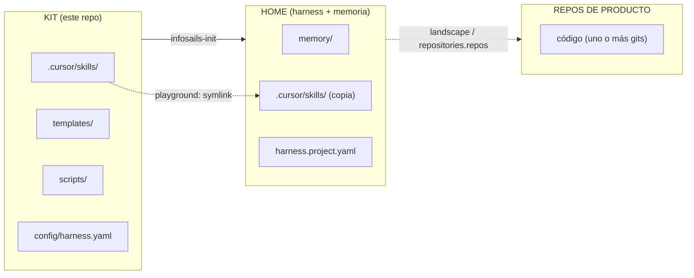

| Concepto | Qué es |
|----------|--------|
| **Kit** | Agentes, templates, schemas, scripts. Se instala una vez en la máquina. |
| **Home** | Repo donde corre el harness: `harness.project.yaml` + `memory/` + skills. |
| **Repos de producto** | Gits del código (`repositories.repos` / landscape). Pueden ser el mismo git que el home o otros. |
| **Memoria** | Fuente de verdad durable (blueprints, designs, builds, deploys, landscape…). No el chat. |
| **Orquesta** | Único interlocutor del usuario a nivel de proceso; solo habla con Leads. |
| **Lead** | Dueño de un proceso; ejecuta el **grafo** de expertos (frontier → subagentes en paralelo). |

```text
~/infosails-harness/                 ← kit
~/Projects/mi-app/                   ← home (orquesta + memory/)
├── harness.project.yaml
├── memory/
├── .cursor/skills/
└── … (código solo si el producto comparte este git)
~/Projects/mi-app-web/               ← repo de producto (si es otro git)
```

---

## 2. Jerarquía de agentes

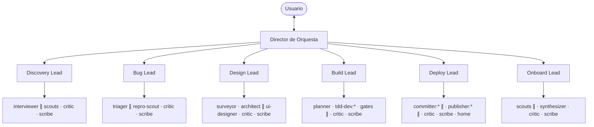

Reglas duras:

- La Orquesta **no** conoce ni activa agentes internos.
- El Lead ejecuta el **frontier** del grafo; los subagentes reportan al Lead; el Lead escribe el **outbox**.
- Guía: [`.cursor/skills/_shared/lead-subagents.md`](.cursor/skills/_shared/lead-subagents.md) · [graph.md](.cursor/skills/_shared/graph.md).

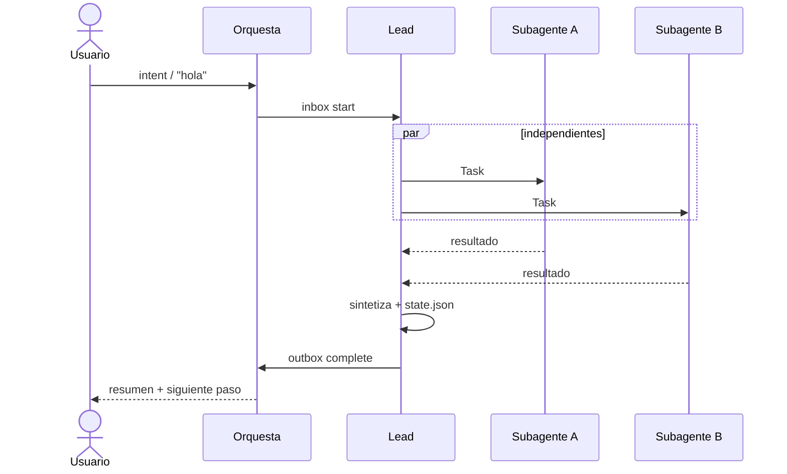

---

## 3. Pipelines

### Historia (Feature Blueprint)

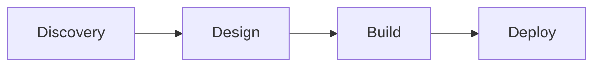

### Bug

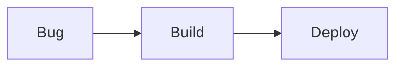

### Onboard (proyecto ya iniciado)

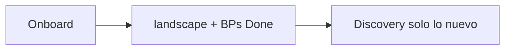

| Transición | Siguiente |
|------------|-----------|
| `discovery_done` | design |
| `design_done` | build |
| `bug_done` | build |
| `build_done` | deploy |
| `onboard_done` | — (menú) |
| `deploy_done` | — |

La Orquesta **activa** y **delega** según `next_hint` del outbox y `config/harness.yaml`.

Deploy (activo): commit + push a `main` (producto + home) y **`vercel --prod`** en las apps Vercel.

---

## 4. Protocolo Orquesta ↔ Lead

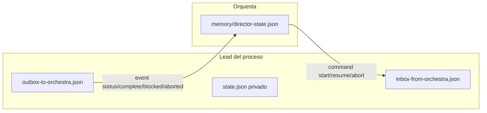

| Nivel | Archivo |
|-------|---------|
| Pipeline global | `memory/director-state.json` |
| Orquesta → Lead | `memory/processes/<proceso>/inbox-from-orchestra.json` |
| Lead → Orquesta | `memory/processes/<proceso>/outbox-to-orchestra.json` |
| Agentes del proceso | `memory/processes/<proceso>/state.json` (`graph` = frontier) |

**Eventos de outbox:** `status` · `complete` · `blocked` · `aborted`  
Protocolo: [`.cursor/skills/director/protocol.md`](.cursor/skills/director/protocol.md).

La Orquesta **tiene prohibido** leer/editar `processes/*/state.json` o lanzar subagentes.

---

## 5. Memoria del proyecto

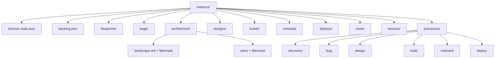

| Carpeta | Dueño típico | Contenido |
|---------|--------------|-----------|
| `blueprints/` | Discovery / Onboard | Historias; Onboard escribe **Done** (as-built) |
| `bugs/` | Bug | Bug Briefs |
| `architecture/` | Design / Onboard | Landscape, ADRs, as-built, repos, infra |
| `designs/` | Design | Design Packages (input de Build) |
| `builds/` | Build | Build Reports (gates TDD/cov/mutación/SAST/e2e) |
| `onboard/` | Onboard | Informe de seed brownfield |
| `deploys/` | Deploy | Deploy Reports (SHA en `main` de producto y del home) |
| `lessons/` | Lead que bloquea | Calidad rechazada del proceso anterior (`LSN-…`) |
| `costs/` | Hook Cursor | Tokens (y USD estimado) por historia / bug / proceso |
| `processes/*/` | Cada Lead | state + inbox + outbox |
| `director-state.json` | Orquesta | Focus, artefactos, procesos, historial |

IDs típicos: `BP-YYYYMMDD-SEQ` · `DS-…` · `BR-…` · `DR-…` · `ADR-…` · `BUG-…` · `ONBOARD-…` · `LSN-…`

### Costos por historia

Cada turno del agente (hook Cursor `stop` / `subagentStop`) se atribuye al artefacto en focus y queda en `memory/costs/`:

| Archivo | Qué guarda |
|---------|------------|
| `events.jsonl` | Historia de turnos (tokens, modelo, proceso, `BP-…` / `BUG-…`) |
| `ledger.json` | Totales del proyecto, por artefacto y por proceso (discovery, design, build, bug…) |
| `rates.json` | USD por 1M tokens (opcional). Con `null` solo se cuentan tokens |

La Orquesta muestra el gasto al ver estado y lo copia a `director-state.json` → `history[].usage` al cerrar un proceso.

Esto **no** es la factura de Cursor (suscripción / dashboard). Es consumo atribuido a este producto. Para ver dinero, completá `rates.json`. `harness.project.yaml` → `costs.enabled: false` apaga el hook.

---

## 6. Procesos en detalle

### 6.1 Discovery Lead

**Salida:** `memory/blueprints/`  
**Skill:** [`.cursor/skills/discovery/SKILL.md`](.cursor/skills/discovery/SKILL.md)

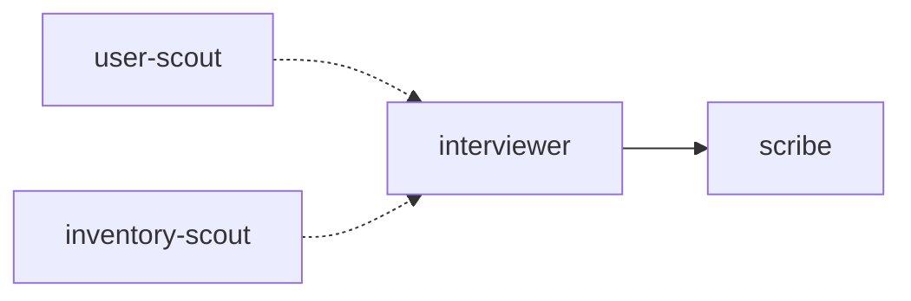

Rondas de entrevista (periodista):

| Ronda | Qué cierra |
|-------|------------|
| A | Contexto y dolor |
| A1 | **Usuarios** (perfiles, contexto, dispositivo, habilidad) |
| A1b | **Tipo de aplicación** (investigar o proponer + confirmar) |
| A2 | Inventario `YA_EXISTE` / `PARCIAL` / `NUEVO` |
| A3 | Soluciones exteriores + matriz de tipos de integración |
| B | Core atómico |
| C | Guardrails (≥5 NO) |
| D | Gherkin (≥3; rol en el *Dado que*) |
| E | Espejo y confirmación |

### 6.2 Bug Lead

**Salida:** `memory/bugs/`  
Agentes: `triager` → `scribe` (+ `repro-scout` ∥ opcional).

### 6.3 Design Lead

**Salida:** `memory/designs/` + `memory/architecture/`  
**Skill:** [`.cursor/skills/design/SKILL.md`](.cursor/skills/design/SKILL.md)

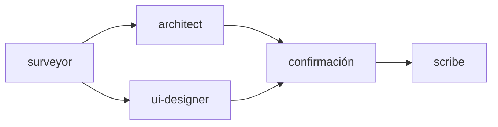

| Agente | Responsabilidad |
|--------|-----------------|
| `surveyor` | Landscape, ADRs, BP (usuarios, tipo app, integraciones), infra |
| `architect` | Hexagonal + infra Vercel/GCP + repos + **Mermaid** (componentes y secuencia) |
| `ui-designer` | Kit UI del producto (elegir / heredar) + spec + sabores; perfiles del BP |
| `scribe` | DS + landscape/ADRs/repos; crear repos si aplica |

Diagramas: [`.cursor/skills/design/diagrams.md`](.cursor/skills/design/diagrams.md)  
UI / sabores: [`.cursor/skills/design/ui-designer.md`](.cursor/skills/design/ui-designer.md)

### 6.4 Build Lead

**Salida:** código del producto + `memory/builds/`  
**Estándares:** [`.cursor/skills/build/standards.md`](.cursor/skills/build/standards.md)

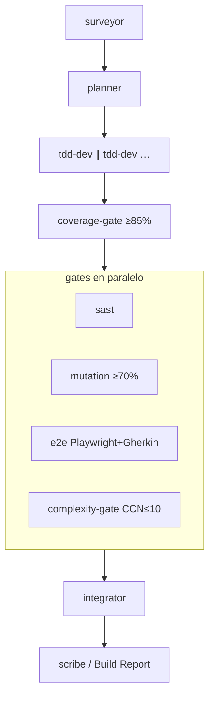

| Gate | Regla |
|------|--------|
| TDD | Red → Green → Refactor; seguridad de comportamiento en Red si aplica |
| Cobertura | ≥ **85%** scope historia |
| Complejidad | CCN McCabe ≤ **10** en funciones nuevas/tocadas |
| Mutación | score ≥ **70%** (default) |
| SAST | Semgrep (u stack); ERROR/HIGH/CRITICAL in-scope = fail |
| E2E | **Playwright** mapeado a Gherkin del BP (o skip justificado) |
| Secretos | Pedir; no inventar ni commitear |

SAST: [`.cursor/skills/build/sast.md`](.cursor/skills/build/sast.md)  
Complejidad: [`.cursor/skills/build/complexity.md`](.cursor/skills/build/complexity.md)

Build **no** pushea a `main` ni corre `vercel deploy` / `gcloud` publish. Eso es Deploy.

### 6.5 Onboard Lead

**Salida:** landscape + BPs **Done** + `memory/onboard/`  
**Skill:** [`.cursor/skills/onboard/SKILL.md`](.cursor/skills/onboard/SKILL.md)

Hidrata memoria desde un producto ya iniciado. No escribe código. Tras `complete` no hay siguiente Lead automático (menú).

### 6.6 Deploy Lead

**Salida:** `main` pusheada + Vercel prod + `memory/deploys/`  
**Skill:** [`.cursor/skills/deploy/SKILL.md`](.cursor/skills/deploy/SKILL.md)  
**Git:** [`.cursor/skills/deploy/git.md`](.cursor/skills/deploy/git.md)  
**Vercel:** [`.cursor/skills/deploy/vercel.md`](.cursor/skills/deploy/vercel.md)

Deploy commitea y pushea a **`main`**, y después publica con **`vercel --prod --yes`**:

1. **Repos de producto** — el código.
2. **Vercel** — cada app Vercel de esos repos (landscape / `.vercel`). Auth: `VERCEL_TOKEN` o `vercel login`.
3. **Home** — `memory/` (el informe DR va en ese commit). No se publica en Vercel.

Si producto y home son el mismo git, un solo push git.  
Playground del kit: **no** pushea `infosails-harness`; sí apps de producto y Vercel si están linkeadas.

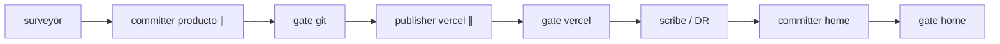

| Qué | Qué no |
|-----|--------|
| `git push origin main` (sin `--force`) | Force-push; commitear `.env` |
| `vercel --prod --yes` tras el git | Preview (`vercel` sin `--prod`) como este Deploy; `--token` en la CLI |
| `complete` = main + URL de prod (o skip Vercel documentado) | Inventar URL; `gcloud` salvo pedido y landscape GCP |

Si `main` está protegida y el push falla → `blocked` (no Vercel). Si git ok y Vercel falla → `blocked` parcial. Si falló solo el home → producto y Vercel pueden haber quedado landed.

---

## 7. Políticas de organización

Definidas en `config/harness.yaml` → `org` y skills de Design.

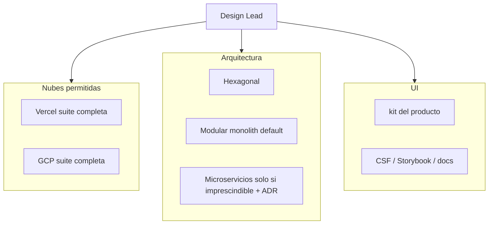

| Política | Regla |
|----------|--------|
| Nubes | Solo **Vercel** y **GCP** (suites completas). Otra nube = ADR de excepción. No forzar front→Vercel / back→GCP. |
| Arquitectura | **Hexagonal**; microservicios solo con ADR y necesidad absoluta. |
| UI | El **producto elige** el kit (shadcn, MUI, InfoSails, custom, ninguno, …). Sin default. Documentar en landscape. Cambiar de kit = ADR. Preguntar tema/sabor/densidad/features. |
| Diagramas | Mermaid de **componentes** y **secuencia** en landscape, ADRs relevantes y Design Packages. |

---

## 8. Flujo completo de una historia

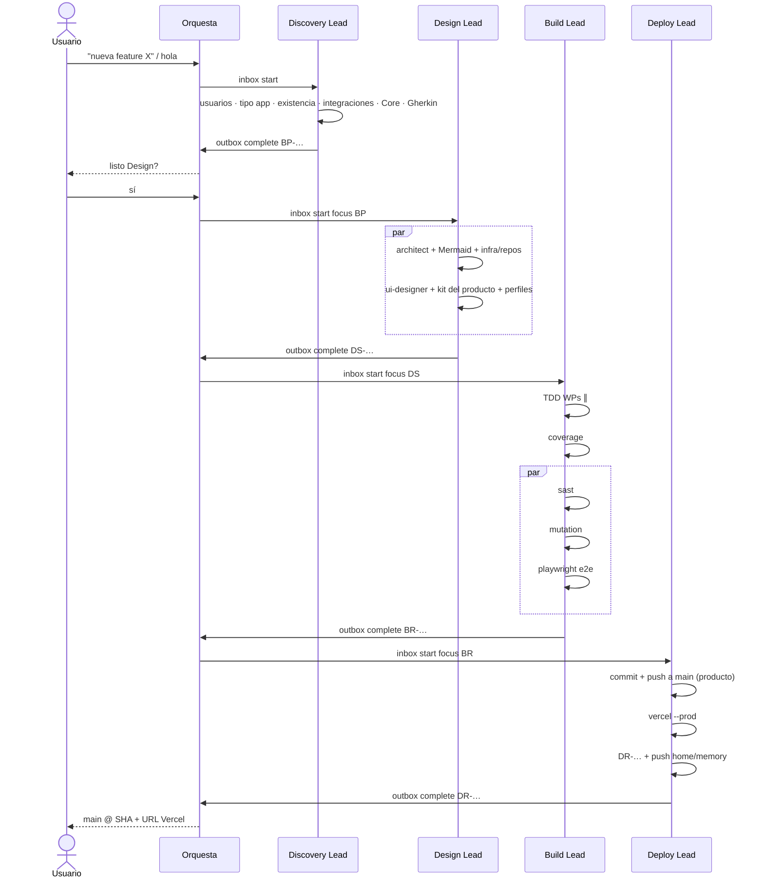

---

## 9. Playground

Proyecto simulado **dentro del kit** (no hace falta `infosails-init`).

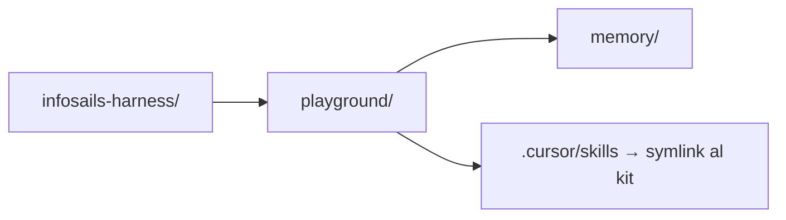

```bash
./scripts/playground                         # crear / refrescar
./scripts/playground --reset                 # limpio total
./scripts/playground --reset-keep-blueprints # limpio pero conserva blueprints
./scripts/playground --status                # rutas y conteos
```

En Cursor (abierto en el kit): `hola` o `probar playground`.  
Si existe `playground/harness.project.yaml` → `PROJECT_ROOT = playground/`.

Deploy en playground **no** pushea el git del kit. Detalle: [`playground/README.md`](playground/README.md).

---

## 10. Instalación y proyectos

### Empaquetar runtime (sin playground)

Para llevar a otra máquina o instalar sin el repo de desarrollo del kit:

```bash
./scripts/pack
# → dist/infosails-harness-<version>/
# → dist/infosails-harness-<version>.tar.gz

./scripts/pack --install          # pack + install en esta máquina
./scripts/pack --out ~/kits/is --no-archive
```

Incluye solo: `config/`, `skills/`, `templates/`, `schemas/`, `scripts/install`, `scripts/init-project`, `scripts/update-project`, `scripts/record-usage`.  
**No incluye:** `playground/`, `scripts/playground`, `phases/`.

En el pack las skills van en `skills/` (portable); `infosails-init` también acepta `.cursor/skills` del repo kit.  
Manifest: `config/pack.manifest`.

### Instalar el kit (una vez)

Desde el **repo del kit** (clone de GitHub o pack runtime):

```bash
git clone https://github.com/infosails/infosails-harness.git
cd infosails-harness
./scripts/install
source ~/.zshrc   # o la rc de tu shell
```

O desde un **pack runtime** ya descomprimido:

```bash
cd /ruta/al-kit-o-al-pack
./scripts/install
source ~/.zshrc
```

Quedan: comandos `infosails-init`, `infosails-update` y `INFOSAILS_HARNESS_HOME`.

Variables de entorno del kit y del proyecto: [§12](#12-variables-de-entorno).

Para trabajar en proyectos reales no necesitás el playground: instalá el runtime (o el pack) y usá `infosails-init`.

### Proyecto nuevo

```bash
infosails-init mi-app --path ~/Projects/mi-app
cd ~/Projects/mi-app
# Abrir en Cursor → "hola"
```

### Adoptar repo existente

```bash
infosails-init . --into ~/Projects/app-existente
cd ~/Projects/app-existente
# Abrir en Cursor → "hola" → opción Onboard
```

Crea: `memory/`, `.cursor/skills/` (incluye `_shared/`, **onboard** y **deploy**), `harness.project.yaml`, templates, schemas.

**Repos del producto:** si no están en `harness.project.yaml` ni en el chat, **Onboard pregunta** antes de escanear. También podés declararlas en YAML o al activar (`Onboard con repos: web → ., api → ../mi-api`).

Luego el **Onboard Lead** genera solo lo que falta en memoria: landscape, capacidades as-built como blueprints **Done**, índices, backlog e informe `memory/onboard/`. No inventa Design Packages ni Build Reports con gates falsos.

Un proyecto **que ya tiene harness** no se vuelve a instanciar: [§11](#11-actualizar-el-harness-en-un-proyecto).

---

## 11. Actualizar el harness en un proyecto

Hay dos capas. Hay que refrescar **las dos**.

| Capa | Dónde | Qué cambia |
|------|--------|------------|
| Kit (máquina) | `INFOSAILS_HARNESS_HOME` | `infosails-init`, `infosails-update`, templates, skills fuente |
| Home del producto | repo con `harness.project.yaml` + `memory/` | copia de `.cursor/skills/`, templates, schemas, rules |

**No** corras `infosails-init --into` sobre un home que ya tiene harness: pisa `harness.project.yaml` y puede mezclar `memory/`. Usá `infosails-update`.

### Paso 1 — Kit en la máquina

```bash
cd /ruta/al-kit          # o dist/infosails-harness-<version>/
./scripts/install        # desde el kit: ./scripts/pack --install
source ~/.zshrc
```

Comprobá:

```bash
echo "$INFOSAILS_HARNESS_HOME"
infosails-update --help
```

### Paso 2 — Home del producto

`PROJ` es el git del **home** (memoria), no un repo de producto ni el kit.

```bash
# desde el home
infosails-update

# o desde cualquier lado
infosails-update --path ~/Projects/mi-app

# ver qué haría
infosails-update --path ~/Projects/mi-app --dry-run
```

El script:

- Reemplaza `.cursor/skills/` (director, discovery, bug, design, build, onboard, deploy, `_shared`)
- Copia templates, schemas, rules y el hook de tokens
- Crea carpetas `memory/` que falten (p. ej. `processes/deploy`)
- Pasa procesos `planned` → `active` en `director-state.json` si el kit los trae active
- **No** toca `harness.project.yaml`, `.env`, blueprints/designs/builds, ni código de producto

Si `.cursor/skills` es un symlink (playground del kit), no lo pisa.

### Playground (solo desarrollo del kit)

Los skills ya apuntan al kit. Para carpetas de memoria nuevas, sin borrar historias:

```bash
./scripts/playground          # no uses --reset si querés conservar memory/
# o:
./scripts/update-project --path playground
```

### Después

En Cursor, recargá la ventana del **home** (`Developer: Reload Window`) y escribí `hola`. Commiteá las copias (skills, templates, schemas) en el git del home.

---

## 12. Variables de entorno

El kit usa pocas variables. Las del **producto** (Auth0, Vercel, bases, etc.) no viven aquí: las define Design/Build en el `.env.example` de cada proyecto.

Nunca commitees `.env`. No pegues valores en el chat.

| Variable | Dónde | Cuándo | Para qué |
|----------|--------|--------|----------|
| `INFOSAILS_HARNESS_HOME` | Shell (la escribe `./scripts/install`) | Siempre, tras instalar el kit | Ruta del kit. Fallback de `infosails-init` si el comando no resuelve el home solo. |
| `INFOSAILS_BIN_DIR` | Shell, opcional **antes** de `./scripts/install` | Si no querés `~/.local/bin` | Directorio de los symlink `infosails-init` / `infosails-update`. Default: `$HOME/.local/bin`. |
| `GITHUB_TOKEN` | `.env` del **proyecto** (o el entorno) | Design/Build con UI de **registry privado** | p. ej. GitHub Packages (`read:packages`). No hace falta si el kit UI es público ni para clonar este kit. |
| `VERCEL_TOKEN` | `.env` del **home** o del repo de producto | Deploy (`vercel --prod`) | Token de Vercel. El agente lo lee del entorno; no uses `--token` en la CLI. |

### Máquina (install)

`./scripts/install` agrega a tu rc (`~/.zshrc`, `~/.bashrc` o `~/.profile`):

```bash
export INFOSAILS_HARNESS_HOME="/ruta/al-kit"
export PATH="$HOME/.local/bin:$PATH"
```

Para otra carpeta de binarios:

```bash
INFOSAILS_BIN_DIR="$HOME/bin" ./scripts/install
```

Tras reinstalar o cambiar de versión del kit: `source ~/.zshrc` (o abrí una terminal nueva). Si `INFOSAILS_HARNESS_HOME` apunta a un pack viejo y el comando a otro kit, `infosails-init` avisa y usa el del comando.

### Proyecto (`.env`)

`infosails-init` copia `templates/project/.env.example` → `.env.example`. Copiá a `.env` y descomentá lo que uses:

```bash
# Registry privado — solo si el kit UI del producto lo pide
# GitHub Packages: read:packages  https://github.com/settings/tokens
# GITHUB_TOKEN=ghp_...

# Vercel — Deploy Lead (producción tras git)
# https://vercel.com/account/tokens
# VERCEL_TOKEN=...
```

Los costos de tokens **no** usan variables de entorno: van en `memory/costs/` (hook) y tarifas en `memory/costs/rates.json`.

### Qué no configura el kit

Integraciones del producto (Auth0, Stripe, `DATABASE_URL`, `VERCEL_…`, etc.) las pide Build a partir del Design Package y el `.env.example` **del repo del producto**. No las inventes ni las pongas en el kit.

---

## 13. Estructura del kit

```text
infosails-harness/
├── README.md                 ← este archivo
├── LICENSE                   ← Apache 2.0
├── NOTICE                    ← atribución y marca
├── CONTRIBUTING.md
├── CODE_OF_CONDUCT.md
├── SECURITY.md
├── CHANGELOG.md
├── AGENTS.md
├── config/harness.yaml       ← lifecycle, leads, org, gates
├── .github/                  ← issues, PR template, CI
├── .cursor/skills/
│   ├── director/             ← Orquesta (+ costs.md)
│   ├── discovery/
│   ├── bug/
│   ├── design/               ← + ui-designer, diagrams, principles
│   ├── build/                ← + standards, sast, complexity
│   ├── onboard/              ← seed brownfield
│   ├── deploy/               ← git main + vercel --prod
│   └── _shared/              ← lead-subagents, graph, critic, lessons
├── .cursor/hooks.json        ← stop → scripts/record-usage (playground / kit)
├── templates/                ← blueprints, DS, ADR, build-report, onboard, deploy-report, project/
├── schemas/                  ← JSON Schema de artefactos
├── scripts/
│   ├── install
│   ├── init-project          ← infosails-init
│   ├── update-project        ← infosails-update
│   ├── record-usage          ← hook de tokens
│   ├── pack                  ← runtime sin playground
│   ├── playground            ← solo desarrollo del kit
│   └── check                 ← CI / pre-PR (JSON + sintaxis de scripts)
├── phases/                   ← docs por fase (no va en el pack)
├── playground/               ← prueba local (no va en el pack)
└── dist/                     ← salida de ./scripts/pack (gitignored)
```

---

## 14. Referencias

### Procesos

| Proceso | Lead | Escribe | Status |
|---------|------|---------|--------|
| Discovery | Discovery Lead | `memory/blueprints/` | active |
| Bug | Bug Lead | `memory/bugs/` | active |
| Design | Design Lead | `memory/designs/` + `memory/architecture/` | active |
| Build | Build Lead | código + `memory/builds/` | active |
| Onboard | Onboard Lead | landscape + BPs Done + `memory/onboard/` | active |
| Deploy | Deploy Lead | `main` + Vercel prod + `memory/deploys/` | active |

### Skills y guías

| Tema | Ruta |
|------|------|
| Orquesta | `.cursor/skills/director/SKILL.md` |
| Costos / tokens | `.cursor/skills/director/costs.md` |
| Protocolo inbox/outbox | `.cursor/skills/director/protocol.md` |
| Subagentes / grafo | `.cursor/skills/_shared/lead-subagents.md` · `graph.md` |
| Crítico de calidad | `.cursor/skills/_shared/critic.md` |
| Lecciones | `.cursor/skills/_shared/lessons.md` |
| Entrevista Discovery | `.cursor/skills/discovery/interview.md` |
| Principios arquitectura | `.cursor/skills/design/architecture-principles.md` |
| Diagramas Mermaid | `.cursor/skills/design/diagrams.md` |
| UI / design system | `.cursor/skills/design/ui-designer.md` |
| Estándares Build | `.cursor/skills/build/standards.md` |
| SAST | `.cursor/skills/build/sast.md` |
| Complejidad ciclomática | `.cursor/skills/build/complexity.md` |
| Deploy | `.cursor/skills/deploy/SKILL.md` |
| Deploy (git a main) | `.cursor/skills/deploy/git.md` |
| Deploy (Vercel prod) | `.cursor/skills/deploy/vercel.md` |
| Variables de entorno | `README.md` §12 |

### Artefactos (templates)

| Artefacto | Template |
|-----------|----------|
| Feature Blueprint | `templates/feature-blueprint.md` |
| Design Package | `templates/design-package.md` |
| ADR | `templates/adr.md` |
| Build Report | `templates/build-report.md` |
| Onboard Report | `templates/onboard-report.md` |
| Deploy Report | `templates/deploy-report.md` |
| Landscape | `templates/project/memory/architecture/landscape.md` |

---

## 15. Contribuir

Issues y PRs son bienvenidos. Guía: [CONTRIBUTING.md](CONTRIBUTING.md). Código de conducta: [CODE_OF_CONDUCT.md](CODE_OF_CONDUCT.md). Changelog: [CHANGELOG.md](CHANGELOG.md).

```bash
git clone https://github.com/infosails/infosails-harness.git
cd infosails-harness
./scripts/playground
./scripts/check
```

El playground y `dist/` no van al git. No subas `.env`.

---

## 16. Seguridad

Vulnerabilidades en privado: [SECURITY.md](SECURITY.md) o un [GitHub Security Advisory](https://github.com/infosails/infosails-harness/security/advisories/new). No las reportes como issue público.

---

## 17. Licencia y marca

El kit se publica bajo la [Apache License 2.0](LICENSE).

**InfoSails** y marcas asociadas no están cubiertas por esa licencia. Podés atribuir el origen del software; no uses el nombre ni logos para insinuar respaldo de InfoSails sin permiso. Ver [NOTICE](NOTICE).

`@infosails/design-system` es un paquete **aparte** (no está en este repo). El harness no lo exige: el producto elige kit UI (política en `config/harness.yaml` → `org.design_system`).

