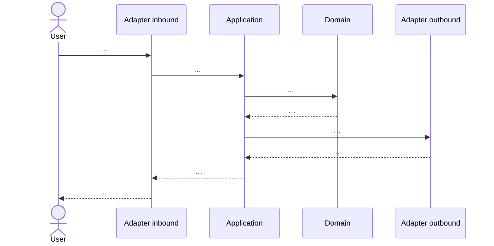

# [DS-ID] Design Package: [Nombre corto]

> **Blueprint:** [BP-ID] — [título]
> **Status:** Ready for Build
> **Creado por:** Design Lead
> **Landscape:** memory/architecture/landscape.md
> **ADRs consultados:** ADR-… 
> **ADRs nuevos:** ADR-… | ninguno
> **Infra veredicto:** reuse | extend | propose_new | blocked_infra
> **Nubes:** Vercel + GCP (suites completas; sin split front/back)

## 1. Lectura de arquitectura existente
* Landscape relevante:
* ADRs que aplican:
* As-built / inventario BP (`YA_EXISTE` / `PARCIAL`):
* Infra Vercel actual:
* Infra GCP actual:

## 2. Objetivo técnico de esta historia
* 

## 3. Diseño propuesto (aplicación)
### 3.0 Estilo
* Deployable(s): modular monolith | … (microservicio solo si ADR)
* Arquitectura interna: **hexagonal** (domain / application / ports / adapters)

### 3.1 Capas hexagonales
| Capa | Qué entra en esta historia | Paths / módulos |
|------|----------------------------|-----------------|
| Domain | | |
| Application (use cases) | | |
| Ports | | |
| Adapters inbound | | |
| Adapters outbound | | |

### 3.2 Componentes / módulos tocados
| Componente | Acción | Capa | Notas |
|------------|--------|------|-------|
| | create \| extend \| reuse | domain\|app\|adapter | |

#### Diagrama de componentes (Mermaid)
```mermaid
flowchart TB
  %% solo lo que toca esta historia + externos relevantes
```

### 3.3 Contratos (APIs, eventos, tipos)
* 

### 3.4 Datos
* Cambios de modelo / migraciones:
* Ownership:

### 3.5 UI / flujos (agente `ui-designer`)
<!-- Obligatorio si hay pantallas. Fuente: @infosails/design-system + csf.md -->

* **Design system:** `@infosails/design-system` (default org)
* **CSF leído:** sí | no (bloqueado: falta token/paquete) | n/a (sin UI)
* **Veredicto UI:** designed | ui_skipped
* Razón si skipped:
* **Perfil primario (BP):** 
* **Tipo de aplicación (BP):** 

#### Sabores / características (preguntar al usuario; no asumir)
| Decisión | Valor | Origen (usuario / landscape / default org / BP) |
|----------|-------|--------------------------------------------------|
| Perfil / audiencia | | blueprint |
| Tipo de app | | blueprint |
| Tema default | light \| dark \| system | |
| Toggle de tema en producto | sí / no | |
| Acento / tokens de marca | sail \| horizon \| void \| solo semánticos \| … | |
| Densidad | densa \| media \| aireada | perfil + tipo app |
| Features DS activas | ThemeProvider, tokens TS, utilities, … | |
| Variantes clave (csf) | Button: … / Card: … / Badge: … | |
| Excluido a propósito | | |

#### Instalación / wiring (si aplica)
* [ ] `.npmrc` GitHub Packages + `GITHUB_TOKEN`
* [ ] dependencia `@infosails/design-system`
* [ ] imports CSS (tokens, theme, utilities) + Tailwind v4
* [ ] `ThemeProvider` / `data-theme` (según matriz)
* [ ] Next: `transpilePackages: ['@infosails/design-system']`

#### Mapa de pantallas → componentes DS
| Pantalla / flujo | Perfil | Ruta o nombre | Componentes (`csf.md`) | Variantes / sabor | Estados (loading/vacío/error) |
|------------------|--------|---------------|------------------------|-------------------|-------------------------------|
| | | | | | |

#### Layout y jerarquía
* 

#### Guardrails UI
* **NO** usar otra librería UI (Material, Chakra, shadcn suelto, …) sin ADR
* **NO** inventar componentes que ya existan en el DS
* **NO** 

### 3.6 Secuencia / flujo técnico (Mermaid)
<!-- Obligatorio. Architect — ver .cursor/skills/design/diagrams.md -->



* Notas / variantes (error, timeout):

### 3.7 Microservicios
* ¿Se propone microservicio nuevo? **no** (default) | **sí** (ADR-… + justificación)
* Justificación (solo si sí):

## 4. Infraestructura (validación o propuesta)
<!-- Obligatorio. Build y ops se apoyan aquí. -->

### 4.1 Veredicto
* **reuse** | **extend** | **propose_new** | **blocked_infra**
* Justificación:

### 4.2 Recursos que se usan (ya existen)
| Recurso | Nube (Vercel\|GCP) | Entorno(s) | Cómo lo usa esta historia |
|---------|--------------------|------------|---------------------------|
| | | | |

### 4.3 Cambios / altas propuestas
| Recurso | Nube (Vercel\|GCP) | Acción | Entornos | Notas / aprobación |
|---------|--------------------|--------|----------|--------------------|
| | | extend \| create | | |

### 4.4 Tareas de infra para Build / ops
* [ ] 
* [ ] Ninguna (solo reuse)
* **NO** provisionar fuera de Vercel/GCP sin ADR

### 4.5 Restricciones respetadas
* 

## 4b. Repositorios (topología)
<!-- Design define y crea. Build no inventa repos. -->
* Veredicto: **reuse_repos** | **add_repo** | **split_or_merge** | **blocked_repos**
* Estrategia: monorepo | multi-repo | híbrido

| Repo | Acción | Rol | Path / URL |
|------|--------|-----|------------|
| | reuse \| create \| retire | | |

* Repos creados en esta historia (comandos / URLs):
* 

## 5. Plan de construcción (para Build)
* [ ] 
* [ ] 
* [ ] 

## 6. Archivos / áreas sugeridas
| Path o área | Cambio |
|-------------|--------|
| | |

## 7. Guardrails técnicos
* **NO** 
* **NO** 
* **NO** 

## 8. Mapeo a aceptación
| Escenario Gherkin (BP) | Cómo se cubre en el diseño |
|------------------------|----------------------------|
| | |

## 9. Riesgos y preguntas abiertas
* 

## 10. Actualizaciones de arquitectura
* Impacto as-built: ninguno | extend | modify | deprecate | add
* Impacto infra: ninguno | extend | create | constrain
* [ ] Landscape / as-built actualizado
* [ ] Sección infraestructura del landscape actualizada
* [ ] Tabla de **repositorios** actualizada (y repos creados si apply)
* [ ] Historial de arquitectura append
* [ ] ADR(s) creados/actualizados
* [ ] Sin cambio landscape/as-built/infra (justificado)
